# Mood Canvas

*Built solo for the Long Horizon Agents hackathon with Liquid AI, Tinybird, Nimble and Black Forest Labs.*

Journaling works, but nobody rereads their journal. Mood Canvas is a long-horizon agent that reads your patterns for you. Week after week it forms a hypothesis about what drives your low days, runs a small habit experiment, measures the result, and corrects itself when it's wrong. Each check-in also becomes a painting. Your words are never stored, and the agent's whole memory is a card of about 360 tokens.

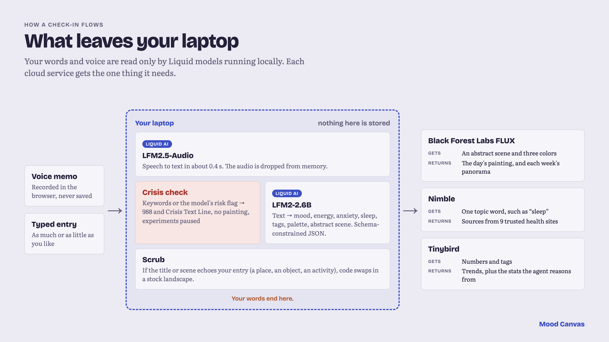

## The agent loop

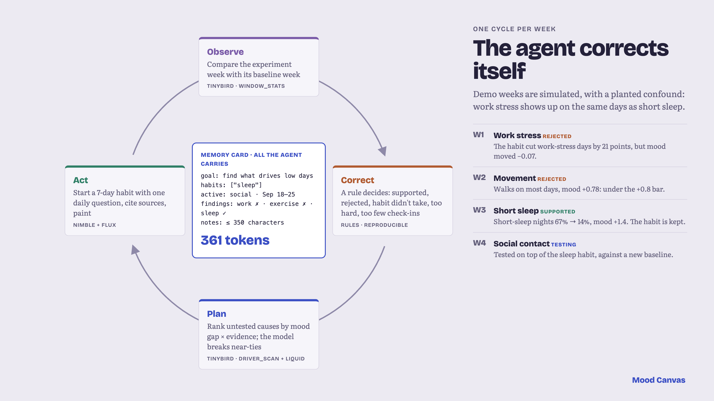


| Step | What happens | Event partner |
|---|---|---|
| Observe | Compare the experiment week with a baseline (`window_stats`) | Tinybird |
| Correct | Rule-based verdict: supported, rejected, lever didn't move, too hard (shrink the ask), too few check-ins (extend) | |
| Plan | Rank untested drivers by mood gap × evidence (`driver_scan`); the planner LLM picks one and explains why | Liquid (or any planner) |
| Act | Start a 7-day habit experiment with a daily check-in question, cite trusted sources, paint the week | Nimble, Black Forest Labs |

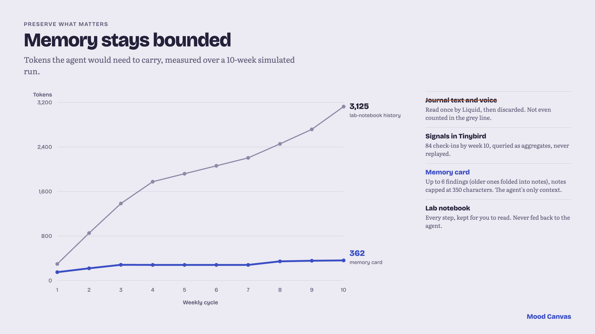

**Preserving what matters.** Raw journal text is discarded after Liquid extracts the signals. Signals live in Tinybird. The agent carries only a memory card: its goal, confirmed habits, compact findings, and notes capped at 350 characters. The oldest findings are folded into those notes. The full lab notebook is kept for you and never fed back to the agent, so its context stays flat however long it runs.

## Weekly exhibitions and sharing

**Weekly exhibitions.** Each week, whether a baseline or an experiment week, can be composed into one panorama. Up to 8 of that week's paintings go to FLUX.2 [pro] as multi-reference images, with a prompt built only from the week's mood arc ("begins heavy and muted, ends steady; the light gradually opens up"). FLUX.1 Kontext takes a single input image, so FLUX.2 is the model that can combine them. Each composite costs about 9 credits, takes about 20 s, and is saved to `backend/static/exhibitions/` so it's generated once.

**Painting styles.** Pick how your day is painted: Mood (the default, where the brushwork follows your mood), or a style after a public-domain painter: Impressionist (Monet), Post-Impressionist (Van Gogh), Woodblock print (Hokusai), Luminous Romantic (Turner), Gilded (Klimt), Abstract composition (Kandinsky) or Spiritual abstraction (Hilma af Klint). The scene, palette and energy still come from your check-in; the style changes only the technique. Prompts describe technique and never name a painter, so FLUX doesn't imitate a specific canvas. Painting prompts tend to produce fake signatures in the bottom corners however they're worded, so every image is trimmed by 10% at the bottom and 5% at the sides.

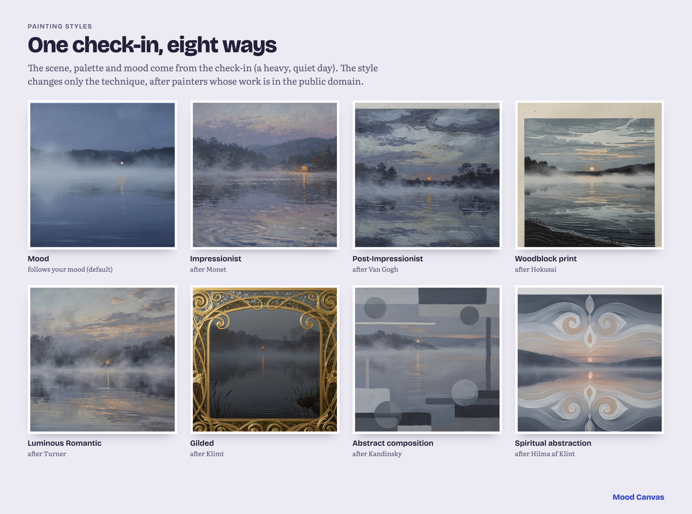

**Share a painting.** Any painting or exhibition can be shared as a card drawn in the browser: the painting, its title, one gentle caption you pick ("This is how I'm doing.", "A heavy one today."…) and, optionally, the date. It never includes your entry, scores or tags. Share with the system share sheet where the browser supports it, copy the image, or download a PNG.

## How it works

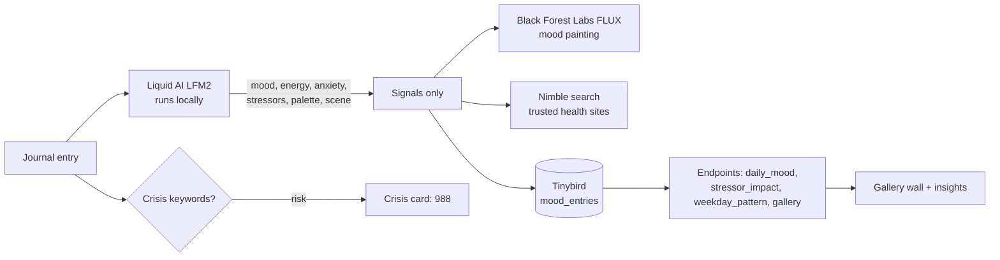

The raw text (or voice memo) only ever goes to local Liquid models. FLUX receives an abstract scene and palette, Nimble receives a topic like "work", and Tinybird stores numbers and tags. That separation is the privacy story, and it's enforced in code: if the model's title or scene echoes the entry (a place, an object, an activity), it's replaced with a stock landscape before it leaves the machine.

## Setup (about 30 minutes)

**1. Liquid model.** Any OpenAI-compatible server works. We run LFM2 locally with llama.cpp (the model downloads about 1.6 GB on first run):
```bash
brew install llama.cpp
llama-server -hf LiquidAI/LFM2-2.6B-GGUF --alias LFM2-2.6B --jinja -c 8192 --port 8080
```
Extraction uses schema-constrained JSON (`response_format` json_schema), which llama-server supports. On an Apple Silicon GPU it takes about 2.5 s per entry, and about 5 s on 4 CPU threads. To host it elsewhere, run the same command on a server and point `LIQUID_BASE_URL` at it.

**1b. Voice check-ins (optional).** Liquid's LFM2.5-Audio model transcribes voice memos locally. Mainline llama.cpp doesn't support it yet, so use Liquid's runner from [LiquidAI/LFM2.5-Audio-1.5B-GGUF](https://huggingface.co/LiquidAI/LFM2.5-Audio-1.5B-GGUF): download `runners/llama-liquid-audio-macos-arm64.zip` and the four `*-Q4_0.gguf` files (about 1.1 GB) into `~/models/lfm2.5-audio`, unzip the runner into `runner/`, then:
```bash
D=~/models/lfm2.5-audio; cd $D/runner/llama-liquid-audio-macos-arm64
./llama-liquid-audio-server -m $D/LFM2.5-Audio-1.5B-Q4_0.gguf -mm $D/mmproj-LFM2.5-Audio-1.5B-Q4_0.gguf \
  -mv $D/vocoder-LFM2.5-Audio-1.5B-Q4_0.gguf --tts-speaker-file $D/tokenizer-LFM2.5-Audio-1.5B-Q4_0.gguf --port 8082
```
The "Speak instead" button appears only when this server is running. The browser records, converts to 16 kHz WAV itself, and the backend sends it to the local model. Transcription takes under a second, and the recording is never written to disk.

**2. Tinybird (Forward).** Install the CLI, log in from `tinybird/`, and deploy:
```bash
curl https://tinybird.co | sh
cd tinybird && tb login
tb --cloud deploy
```
The deploy creates a scoped `mood_canvas_app` token (append to both datasources, read the pipes). Copy it from the workspace's Tokens page into `.env` as `TB_TOKEN`, and set `TB_HOST` to the `api` URL shown by `tb info`. `seed.py` uses your `tb login` to clear the tables, because the app token can't.

**3. Backend.**
```bash
cd backend
cp .env.example .env    # fill in keys
python -m venv .venv && source .venv/bin/activate
pip install -r requirements.txt
python seed.py --paint 3   # 2-week baseline, 6 weeks back; resets the agent
uvicorn app:app --reload --port 8000
```
Open http://localhost:8000.

**4. Reset the demo data (any time).** With both Liquid servers running, this clears Tinybird and seeds a clean 14-day baseline with the last 3 days painted:
```bash
cd backend && .venv/bin/python seed.py --paint 3
```
Then click **Run next week** to watch the agent work through simulated weeks. Simulated weeks are labeled as such in the lab notebook.

## Screenshots

| | |
|---|---|
| 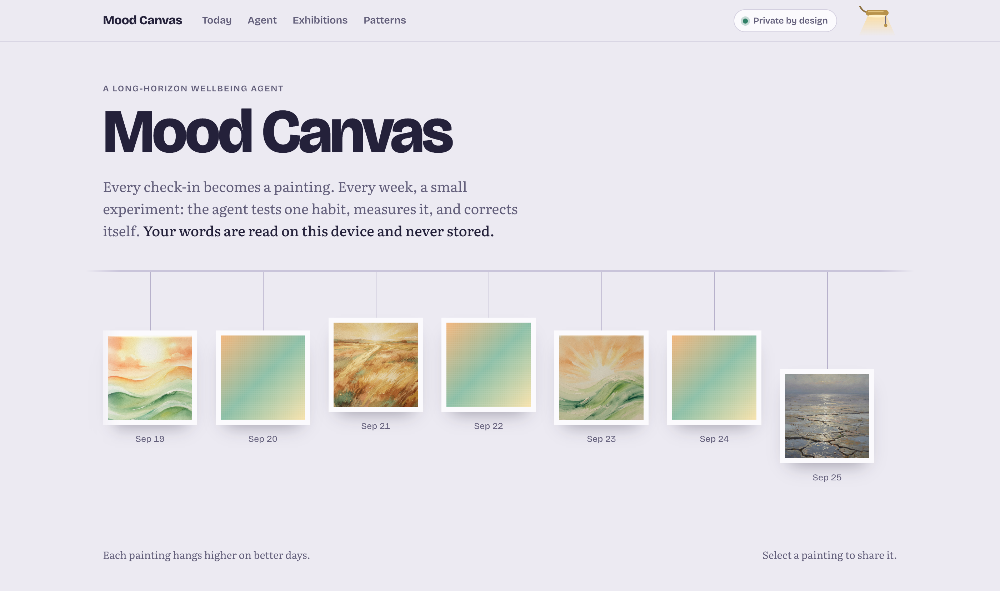 Gallery wall: better days hang higher | 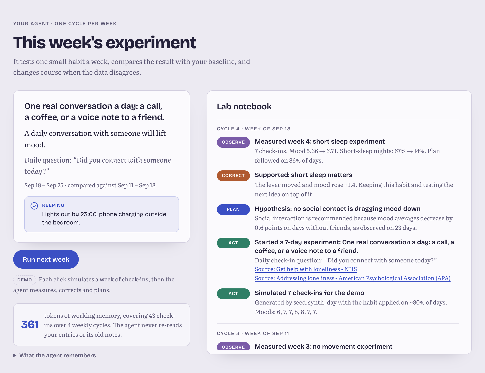 The current experiment, working memory and lab notebook |
| 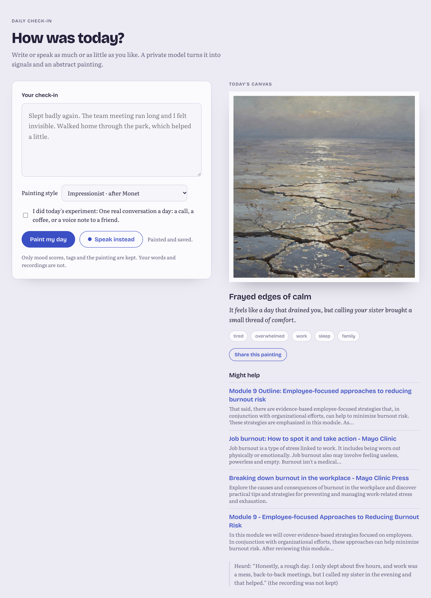 A voice check-in, transcribed locally, painted | 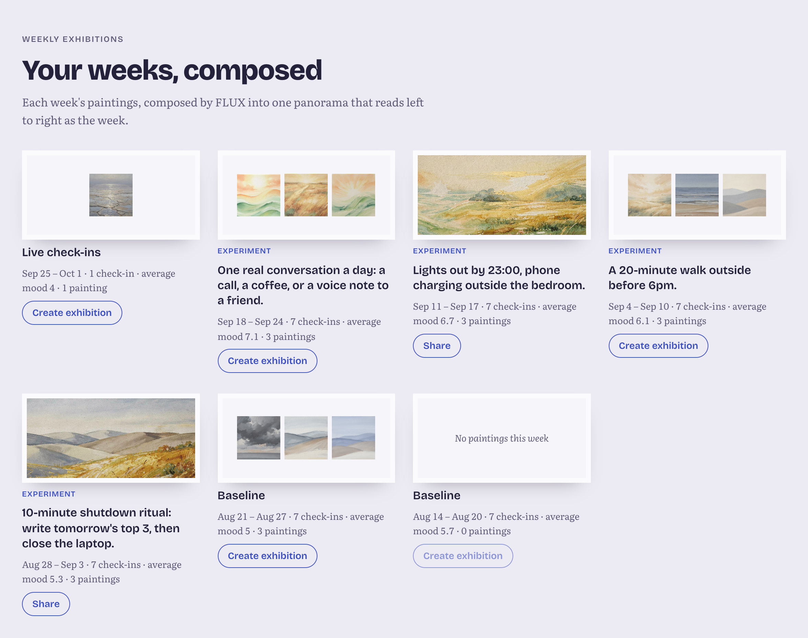 Weekly exhibitions composed by FLUX.2 |
| 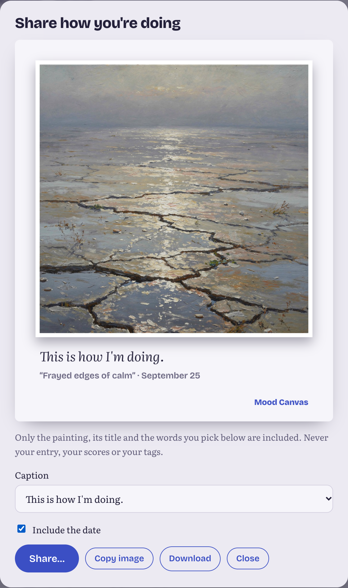 A share card: painting and a chosen caption, never your words | 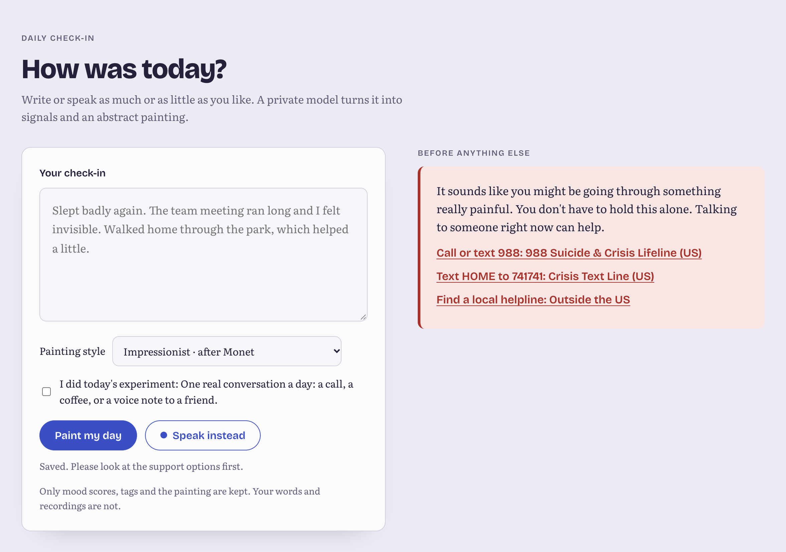 Crisis language shows support options first |
| 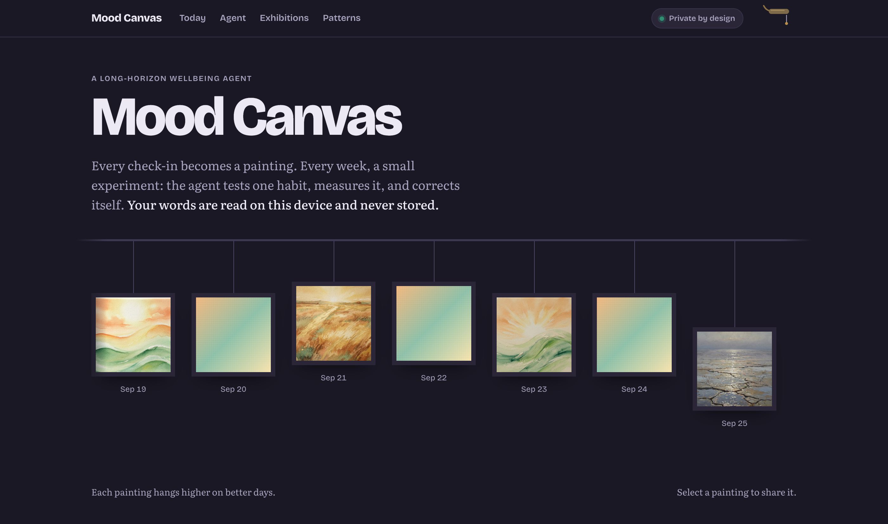 Dark mode: pull the gallery lamp's cord | 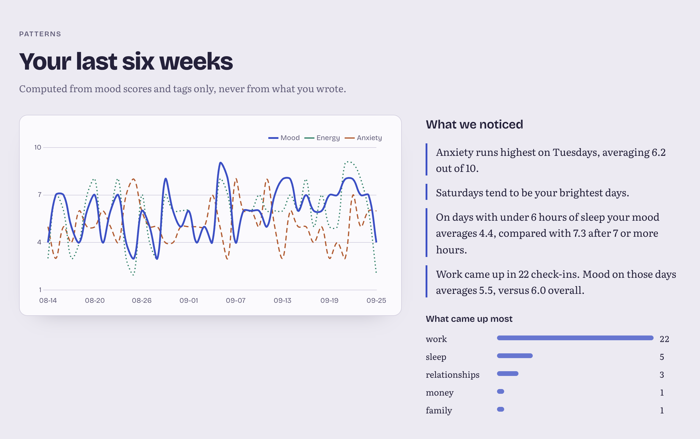 Six weeks of patterns, from scores and tags only |

## License

Code is MIT licensed (see [LICENSE](LICENSE)). The Liquid models are downloaded separately under their own license and are not part of this repo.
